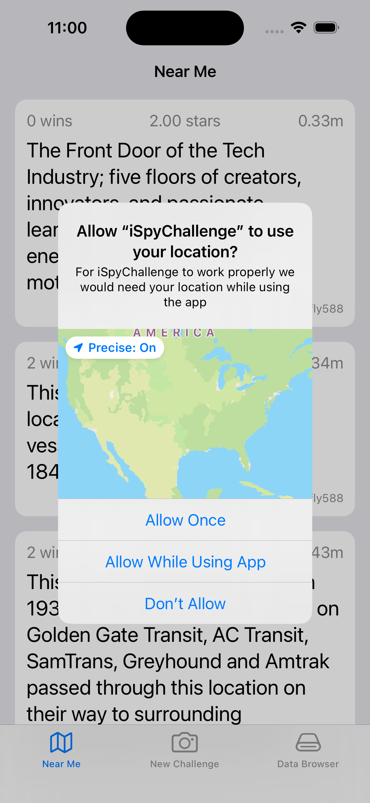
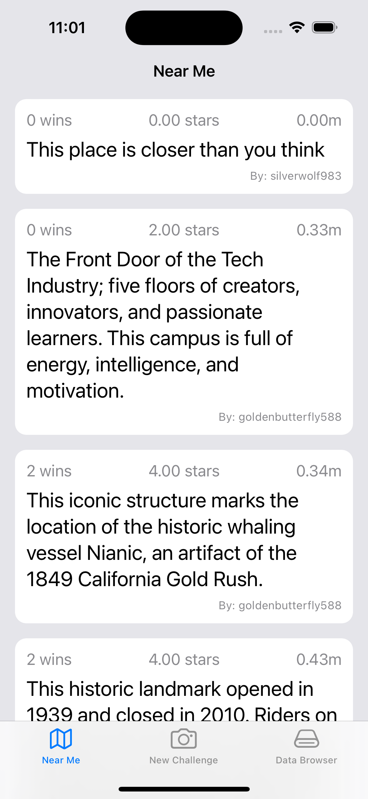
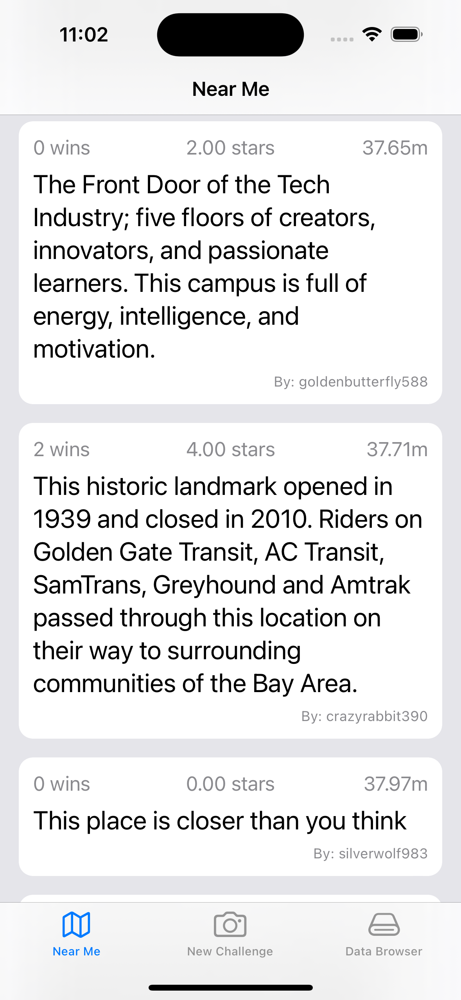
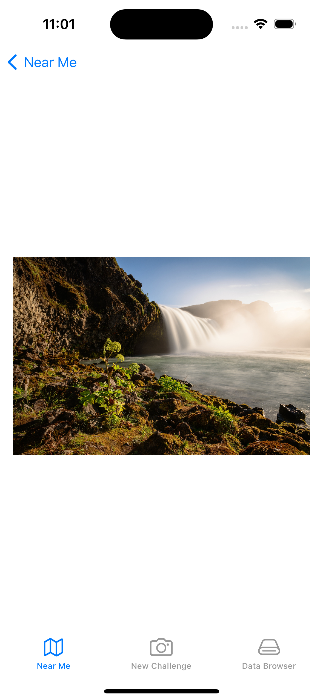
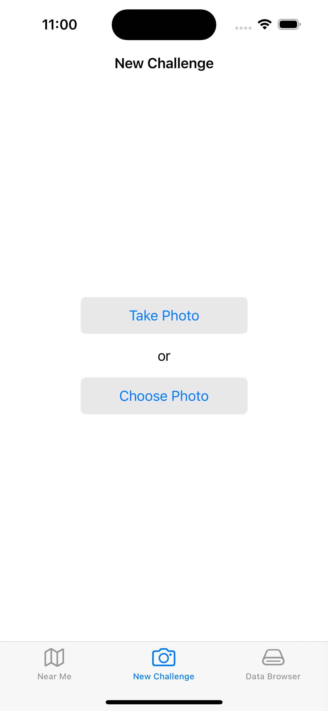
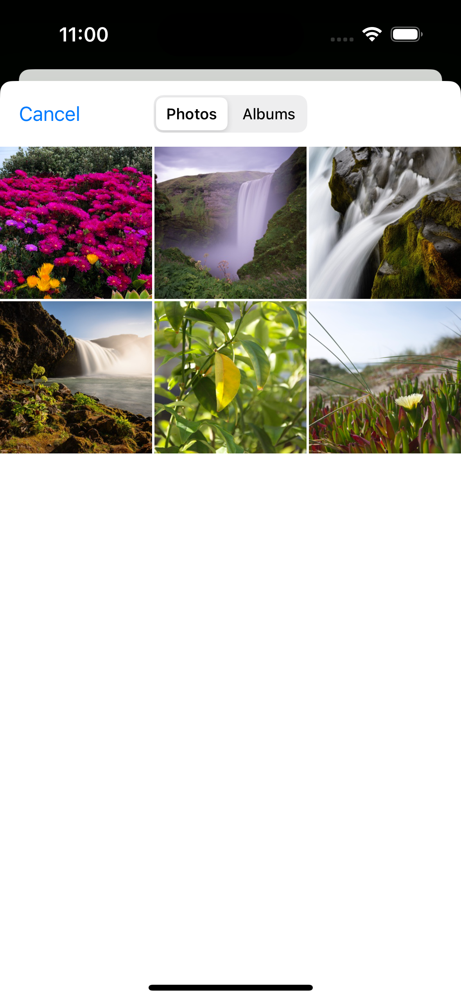
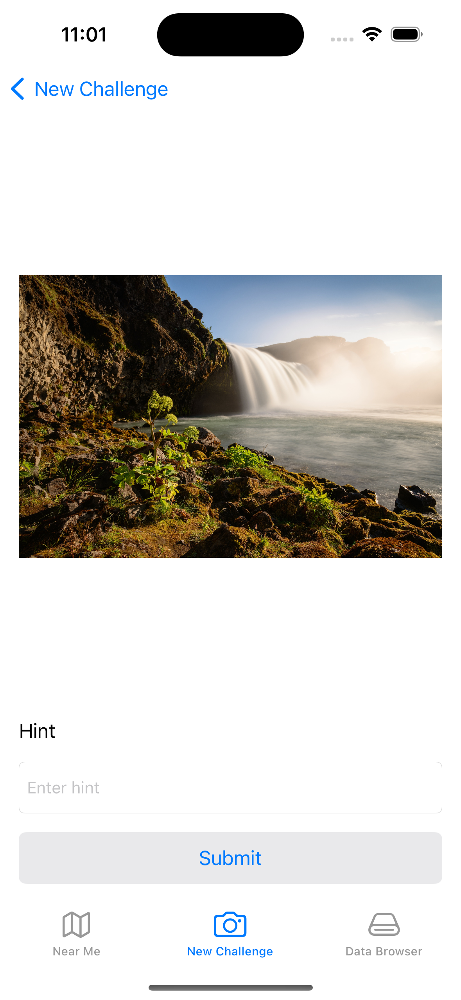

# iSpyChallenge

This repository contains an xCode project that is used as a starting point for the iSpy App Tech challenge.

## Challenge

The goal of the challenge is to provide a project for you to be able to demonstrate your core strengths and evaluate your technical skills. The prompt of your challenge will be provided by the hiring manager or interviewer for your role and you will be building on top of the pre-defined application. You may use your own computer for the challenge and feel free to treat this as your normal environment, so utilizing the internet and libraries/tools to achieve your solution is permitted. The only ask if you are copying and pasting any code from online or old code base, please provide comments to show you understand what you're copying.

The concept for the app is a global game of "I Spy" where users can take pictures of objects they find in the world and have others try to find the same object given only a cryptic hint.

The application contains 3 tabs:

* Near Me: Challenges ordered by the distance to the user
* New Challenge: Create New Challenge flow
* Data Browser: Tab to allow you to explore the data included in the project.

If any questions/concerns come up during the challenge, please feel free to reach out to your interview to get answers/clarifications.

## Setup Process

In order to start the challenge, we ask candidates to clone the repository in their own GitHub account. Please refer to the below snippet of code to create a clone of the project. All you need to do is update the `[username]` tag with your own GitHub username.

````
$ cd ~/Desktop
$ git clone https://github.com/BlueOwlDev/iSpyChallenge.git --origin BlueOwl mySpyChallenge
$ cd mySpyChallenge
$ git remote add origin https://github.com/[username]/mySpyChallenge.git
$ git push -u origin main
````

## Xcode Project Overview

The model objects for the app are provided, along with some sample data for use during the exercise.  All data is maintained in memory and is loaded from sample JSON files, via a mock API service, when the app launches.
 
Access to the sample data is provided via the DataController class. You will need to utilize this class in order to complete the challenge.  iSpyTabBarController constructs the DataController and passes it into each of its view controllers (currently only DataBrowserViewController).  Additionally, there are convenience functions for navigating DataController's data in DataController+iSpy.swift.

## Screen Shots

The following screenshots are what the current implementation of the application looks like.

<kbd>

<kbd>

<kbd>

<kbd>

<kbd>

<kbd>

<kbd>

<kbd>

